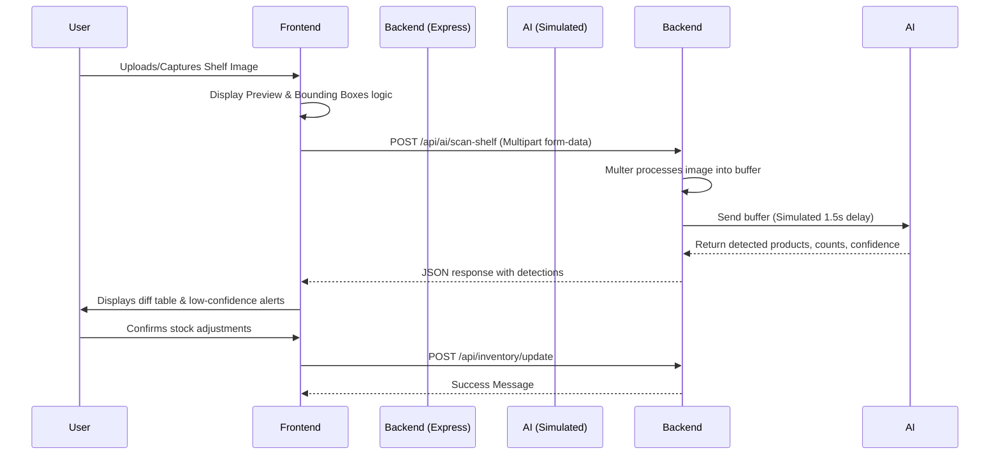

# StoreSync - Architecture & Documentation

This document outlines the detailed system architecture, data flows, and API specifications for the StoreSync prototype.

## 1. System Architecture Diagram

The following Mermaid diagram illustrates the current prototype architecture alongside the proposed production architecture.

```mermaid
graph TD
    %% Frontend Components
    subgraph Frontend [Frontend Client]
        UI[StoreSync Dashboard HTML/Tailwind]
        State[App State app.js]
        MockDB[Frontend Data data.js]
    end

    %% Backend Components
    subgraph Backend [Node.js / Express Server]
        API[Express Router server.js]
        Upload[Multer Image Processing]
        SimDB[In-Memory Mock DB]
    end

    %% Simulated / Future Components
    subgraph Future [Production Microservices]
        PostgreSQL[(PostgreSQL DB)]
        AI_CV[PyTorch/TensorFlow CV Model]
        POS[Legacy POS Webhooks]
    end

    %% Flow
    UI <-->|REST API / JSON| API
    State --> UI
    MockDB --> State
    API --> Upload
    Upload -->|Simulated Delay| API
    API <--> SimDB
    
    %% Production Connections (Dotted)
    API -.->|Proxy image data| AI_CV
    API -.->|CRUD| PostgreSQL
    POS -.->|Sync Data| API
    
    classDef future stroke-dasharray: 5 5, fill:#2d2d3f,stroke:#6d5bee;
    class Future,PostgreSQL,AI_CV,POS future;
```



## 2. Component Design

### 2.1 Frontend (`app.js`, `data.js`, `index.html`)
The frontend is built as a Single Page Application (SPA) using Vanilla JS and Tailwind CSS.
- **Pages / Views:** Dashboard, Inventory, Demand Forecast, Alerts, Analytics, Integrations.
- **State Management:** Handled via global variables in `app.js` (`currentImageSrc`, `currentDetections`, `activeInventoryFilter`).
- **Data Simulation:** `data.js` populates the initial state using a robust mock inventory array and simulates AI bounding box generation (`simulateShelfScan`).

### 2.2 Backend (`server.js`)
A lightweight Express server built to demonstrate the API contracts required for the full product.
- **Static Hosting:** Serves the frontend assets directly.
- **Middleware:** Uses `cors` for Cross-Origin requests and `express.json()` for parsing.
- **File Uploads:** Uses `multer` with memory storage to handle image uploads from the frontend without saving to disk, maintaining speed for the prototype.

## 3. Data Flow: AI Shelf Sync

When a store owner scans a shelf, the following sequence occurs:



## 4. API Specifications

### 4.1 Inventory API

**`GET /api/inventory`**
- **Purpose:** Fetches all current stock.
- **Response:**
  ```json
  {
      "success": true,
      "data": [
          { "id": 1, "name": "Britannia Brown Bread", "category": "Dairy", "price": 45, "stock": 8 }
      ]
  }
  ```

**`POST /api/inventory/update`**
- **Purpose:** Batch update stock counts after an AI scan or manual entry.
- **Payload:**
  ```json
  {
      "updates": [
          { "productId": 1, "newStock": 12 }
      ]
  }
  ```

### 4.2 AI Computer Vision API

**`POST /api/ai/scan-shelf`**
- **Purpose:** Endpoint to proxy image data to the AI model.
- **Content-Type:** `multipart/form-data` (requires `shelfImage` field).
- **Response:**
  ```json
  {
      "success": true,
      "message": "Shelf image analyzed successfully",
      "detections": [
          { "productId": 1, "label": "Britannia Brown Bread", "count": 5, "confidence": 98.5 }
      ]
  }
  ```

### 4.3 POS Integrations API

**`POST /api/integrations/pos-sync`**
- **Purpose:** Webhook for legacy POS systems (Tally/Marg) to push daily ledger data.
- **Payload:**
  ```json
  {
      "source": "Tally",
      "syncData": { "...": "..." }
  }
  ```

## 5. Mock Database Schema (`data.js`)
The `inventory` array acts as the core database table, tracking:
- `id` (Integer): Unique identifier.
- `name` (String): Product display name.
- `brand` (String): Manufacturer.
- `category` (String): Department (e.g., Dairy, Snacks).
- `unit` (String): Packaging size (e.g., 500g, 1L).
- `price` (Number): Selling price in INR.
- `systemStock` (Integer): Current known stock quantity.
- `lastSyncedAt` (ISO Date String): Timestamp of last inventory check.
