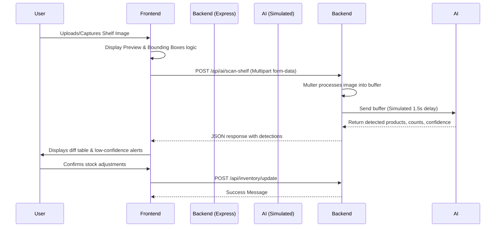

# StoreSync - Perfect Backend Blueprint


## Overview
StoreSync is a prototype and blueprint for an AI-powered inventory management and demand forecasting dashboard for retail stores. Designed for a strict budget, this project provides a fully functional Node.js/Express mock server and a highly interactive frontend dashboard that simulates Computer Vision AI models and PostgreSQL database integrations.

## Features
- **Interactive Dashboard:** Real-time metrics including stock accuracy score, today's orders, revenue, cancellations, and low-stock warnings.
- **Inventory Management:** Full view of the product catalog with dynamic filtering (Low Stock, Out of Stock) and search capabilities.
- **AI Shelf Sync (Simulated):** A simulated computer vision pipeline where a shelf image is uploaded, processed, and bounding boxes are generated to detect stock levels automatically.
- **Demand Forecasting:** AI-driven predictions based on sales history, trends, and seasonality.
- **Actionable Alerts:** Real-time notifications for critical stockouts and reorder recommendations.
- **POS Integrations Blueprint:** Webhook endpoints ready for legacy POS systems like Tally and Marg.

## Technology Stack
- **Frontend:** HTML5, Tailwind CSS, Vanilla JavaScript (`app.js`, `data.js`)
- **Backend:** Node.js, Express.js
- **Upload Handling:** Multer (in-memory storage for prototype)
- **Icons & Fonts:** FontAwesome, Google Fonts (Plus Jakarta Sans)

## Installation & Setup

1. **Prerequisites:** Ensure you have [Node.js](https://nodejs.org/) installed on your machine.
2. **Install Dependencies:**
   Navigate to the project directory and run:
   ```bash
   npm install
   ```
3. **Start the Server:**
   ```bash
   npm start
   ```
   Or manually:
   ```bash
   node server.js
   ```
4. **Access the Application:**
   Open your browser and navigate to `http://localhost:3000`

## Project Structure
- `index.html`: The main dashboard UI containing all pages and styles.
- `app.js`: Frontend logic, state management, and UI rendering.
- `data.js`: Mock frontend database simulating a real database query payload.
- `server.js`: The Express mock server simulating backend APIs and AI processing delay.
- `package.json`: Project metadata and dependencies (`express`, `cors`, `multer`).
- `logo.jpg`: Application logo.

## System Architecture & Data Flow

### 1. Architecture Diagram

```mermaid
graph TD
    %% Frontend Components
    subgraph Frontend [Frontend Client]
        UI[StoreSync Dashboard HTML/Tailwind]
        State[App State app.js]
        MockDB[Frontend Data data.js]
    end

    %% Backend Components
    subgraph Backend [Node.js / Express Server]
        API[Express Router server.js]
        Upload[Multer Image Processing]
        SimDB[In-Memory Mock DB]
    end

    %% Simulated / Future Components
    subgraph Future [Production Microservices]
        PostgreSQL[(PostgreSQL DB)]
        AI_CV[PyTorch/TensorFlow CV Model]
        POS[Legacy POS Webhooks]
    end

    %% Flow
    UI <-->|REST API / JSON| API
    State --> UI
    MockDB --> State
    API --> Upload
    Upload -->|Simulated Delay| API
    API <--> SimDB
    
    %% Production Connections (Dotted)
    API -.->|Proxy image data| AI_CV
    API -.->|CRUD| PostgreSQL
    POS -.->|Sync Data| API
    
    classDef future stroke-dasharray: 5 5, fill:#2d2d3f,stroke:#6d5bee;
    class Future,PostgreSQL,AI_CV,POS future;
```


### 2. AI Shelf Sync Data Flow


## Future Roadmap
- Replace in-memory mock databases with **PostgreSQL**.
- Integrate actual **PyTorch/TensorFlow** computer vision microservices via gRPC or HTTP for real shelf scanning.
- Connect live POS systems using the existing webhook skeleton.
